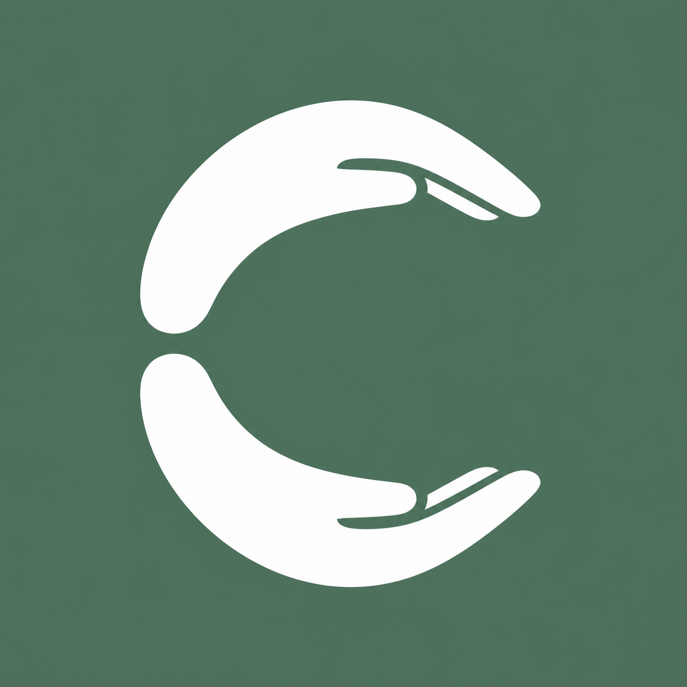

<p align="center">
  
</p>

<h1 align="center">Nest C</h1>

<p align="center">
  Connected cognitive care for patients at home, their caregivers, and their clinical teams.
</p>

<p align="center">
  <a href="https://melissawang1014.github.io/luma-patient-app/"><strong>Open the Patient & Caregiver App</strong></a>
  &nbsp;•&nbsp;
  <a href="https://luma-clinician-workstation.noisy-fig-2085.chatgpt.site/"><strong>Open the Clinician Workspace</strong></a>
</p>

## The problem

People living with cognitive disorders such as Alzheimer’s disease or severe autism often receive most of their care at home. Attending frequent in-person visits can be difficult, while caregivers must manage medications, routines, behavioral changes, and safety concerns with limited support. Clinicians then see only a small snapshot of the patient’s condition during an appointment.

Nest C connects the time between visits. It helps caregivers record meaningful day-to-day observations, gives clinicians a concise view of change over time, and supports remote assessment and follow-up care.

## Try the live demo

### 1. Patient and caregiver experience

**Live app:** [melissawang1014.github.io/luma-patient-app](https://melissawang1014.github.io/luma-patient-app/)

No account is required for the synthetic demos:

1. Open the link.
2. Scroll to **“choose a separated patient demo.”**
3. Select **Margaret Lewis** to explore a late-stage Alzheimer’s care journey, or **Noah Bennett** to explore an autism care journey with very substantial support needs.
4. Use the bottom navigation to explore **Today**, **Trends**, **History**, **Community**, and **Profile**.

The standard sign-in and invitation-code flow demonstrates how a caregiver account can be linked to a patient created by a clinician. The two one-click patient demos use isolated synthetic data and are the fastest option for judging.

### 2. Clinician experience

**Live workspace:** [luma-clinician-workstation.noisy-fig-2085.chatgpt.site](https://luma-clinician-workstation.noisy-fig-2085.chatgpt.site/)

**Hackathon demo login**

- **Email:** `clinician.demo@luma.test`
- **Password:** `LumaDemo!2026`

1. Open the link in a desktop browser for the best layout.
2. Sign in with the hackathon demo credentials above.
3. Start on **Patients** to review the registry, diagnoses, medications, last visits, and green/yellow/red condition indicators.
4. Select a patient to open the longitudinal record and 14-day care summary.
5. Open **Appointments**, then choose **Join now** to see the video-visit workspace with records and clinical guidance beside the call.

## Suggested judge walkthrough

A short end-to-end path takes about three minutes:

1. In the patient app, open **Margaret Lewis** and record a medication or daily-care observation.
2. Review her **Trends** and **History** to see how 14 days of home observations are summarized.
3. In the clinician workspace, open Margaret’s record to review basic information, medications, warnings, cognitive-function visualization, and caregiver notes.
4. Visit **Appointments** and join a video consultation to see the clinician’s side-by-side record, conversation summary, attention points, and suggested treatment changes.
5. Use the clinician actions to send a cognitive assessment or draft medication plan to the linked patient/caregiver account.
6. Try **Add patient** to see the invitation-code workflow that connects a new home-care account to the clinician’s panel.

## What Nest C contains

### Patient and caregiver app

- Daily medication tracking and care checklists
- Sleep, activity, nutrition, mood, behavior, function, and safety observations
- Voice-assisted caregiver notes and structured summaries
- Fourteen-day histories and cognitive/progression trends
- Appointment discovery and booking
- Clinician-assigned assessments and medication-plan visibility
- Separate patient profiles so one person’s data never appears in another demo

### Clinician workspace

- Patient registry with diagnoses, medications, visit recency, and condition status
- Longitudinal patient records with clinical history, alerts, and warnings
- Summaries and visualizations of 14 days of home-care data
- Appointment calendar and remote video-visit workspace
- Side-by-side records, visit notes, conversation summary, attention points, and suggested care-plan changes
- Patient creation and secure invitation-code linking
- Remote cognitive-assessment assignment and draft medication-plan workflows

### Connected data layer

Both experiences use the same Supabase backend. Authentication and row-level security limit access to explicitly linked patients. The data model includes patients, account relationships, care observations, assessments and responses, medication plans and events, clinician summaries, alerts, and patient invitations.

```text
Patient / caregiver app  ──┐
                           ├── Supabase Auth + PostgreSQL + Row Level Security
Clinician workspace      ──┘
```

The repository also contains a database summary function that aggregates a patient’s recent care observations and medication events into a clinician-facing 14-day snapshot.

## Technology

- **Patient/caregiver app:** React, TypeScript, and Vite
- **Clinician workspace:** React, TypeScript, vinext, and Cloudflare-based hosting
- **Shared backend:** Supabase Auth, PostgreSQL, SQL functions, and Row Level Security
- **Deployment:** GitHub Pages for the patient app and OpenAI Sites for the clinician workspace
- **Future EHR integration:** SMART on FHIR / Epic FHIR

## Repository guide

- `src/` — patient and caregiver application
- `luma-clinician-workspace/` — clinician application
- `supabase/migrations/` — database schema, permissions, invitations, and summary engine
- `docs/` — synthetic records and Supabase setup notes
- `docs/SUPABASE_SETUP.md` — backend configuration instructions

## Prototype and safety notice

Nest C is a hackathon prototype that uses synthetic patient data. It is not a medical device, does not diagnose disease, and does not replace professional judgment or emergency services. Medication actions are presented as clinician-authored draft workflows. Before real-world use, the product would require clinical validation, privacy and security review, consent and audit systems, crisis-escalation protocols, and production SMART on FHIR authorization.
